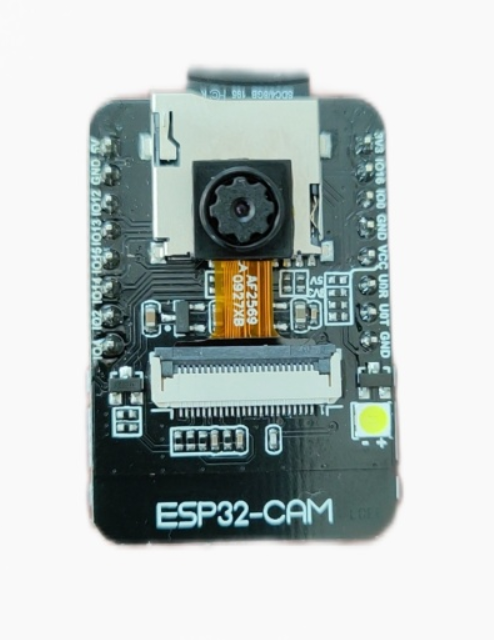
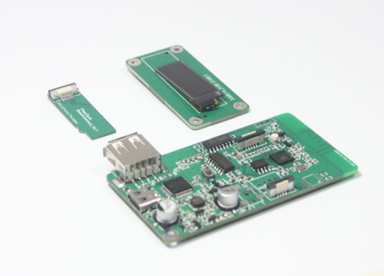

## 1.Beam项目介绍

Beam系列的产品致力于让3D打印变得更智能化，通过IOT技术和机器学习技术，实现3D打印智能化的转变。 通过图像，声音以及加速度等传感器，来让整个3D打印系统更智能化。 核心硬件产品包括Beam Node和Beam Sentry。配合Beam Nexus控制软件，实现一整套的智能化流程。

## 2. Beam Node模块介绍
Beam Node是一款针对FDM而开发，解决让大部分FDM设备具备wifi传输文件和wifi控制打印的模块。区别于树莓派，beam模块使用了更加简洁的微处理器来处理这些任务。

- OLED显示屏
- wifi传输文件
- wifi控制打印
- 易于接入打印机，不需拆机接线
- 丰富的扩展接口，可扩展其他传感器
- 邮件打印通知

Beam的基本参数规格:

| 参数名称   | 规格             | 描述          |
|--------|----------------|-------------|
| 模块尺寸   | 7.4x3.5cm      |             |
| 显示     | OLED(128X32)   |             |
| 存储     | SD卡            |             |
| 供电     | Type-C 5V      |             |
| 与打印机连接 | USB+SD卡共享      | USB和SD卡同时连接 |
| 外壳     | 3D打印           | 提供开源模型     |
| 对外扩展接口 | 串口,I2C, 2个GPIO |             |

## 3. Beam Sentry模块介绍

- wifi图传
- 串口控制打印机
- 视觉检测打印失败
- 视觉检测烟雾，火苗
- 邮件定时拍摄通知，事件触发邮件通知

Beam Sentry是一款专门应用在3D打印领域的wifi摄像头，配合Beam Nexus的使用，可以实现wifi串口控制以及打印失败检测等功能。Beam Sentry目前提供了UART，I2C以及IO口，用户可以在其基础上扩展断料检测，温度传感器，继电器开关等一些类的外设和传感器。

## 4. Beam Nexus软件介绍

Beam Nexus是管理Beam系列硬件的应用软件，除了wifi管理以外，Beam Nexus还实现了邮件通知，机器学习推理等功能，他是Beam系列产品的控制中心。

