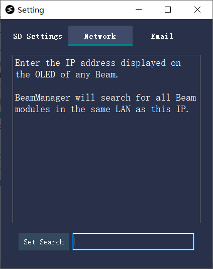
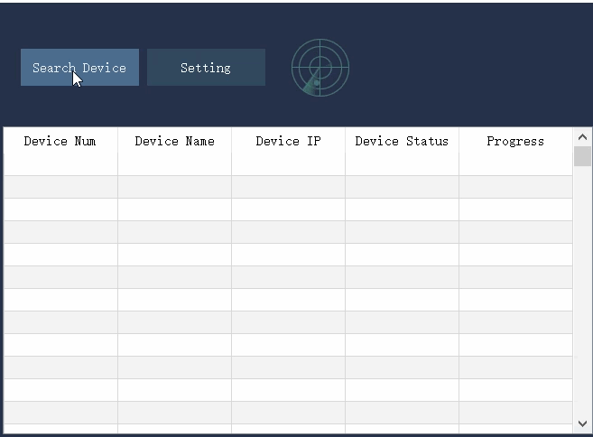

# 1. Beam Node快速开始

## 1. 使用前须知

强烈建议在购买我们的模块之后，下载我们的外壳，使用您的打印机打印出一个外壳来。 注意打印时加入支撑。 模型外壳如下图所示:
[外壳下载链接](https://github.com/fiberpunk1/Beam-ESP32/releases/download/Beta-v0.1.5/shell-stl.zip)

> beta版本的Beam Node, 会在刚上电时，给打印机发送一条G28指令，如果测试，请注意不要让平台有东西。 或者更新我们的正式版本。

## 2. 快速上手

### 2.1 组装模块

- 打印外壳
- 安装好OLED和SD卡槽
- 接口线介绍

### 2.2 安装BeamNexcus和设置邮箱

请从这个[链接](https://github.com/fiberpunk1/Beam-ESP32/releases)下载我们BeamNexus软件的安装包:

> 注意: BeamNexus目前只支持windows版本

###  2.3 配置BeamNode Wifi+SD卡

首先将您的SD卡和读卡器，插入到电脑:

插入SD卡后，打开BeamManager，点击下图中所示的Setting按钮:

单击后弹出下图所示的窗口，我们要在这里填写Wifi名和密码，以及为您的Beam模块去一个设备名(局域网不要重复使用同一个设备名)。具体的填写内容，如下图所示:

> 注意1: Sentry的配网方式跟上述的步骤一样，也是使用功能SD卡进行配网。

> 注意2: 如果您的电脑没有wifi模块，Scan Wifi将会失败，并提示您要手动输入您路由器的ssid名称。如果您的有线网络和wifi是同一个路由器下，那么Beam依然是可以被访问到的。

按照上面介绍的内容填写好以后，点击Save To SD保存相关的配置文件到SD卡中。 拔出SD卡，按照下图所示，将SD卡插入到Beam模块中，稍微用力推一下，感受到弹簧反弹一下，说明SD卡插紧了。

###  2.4 安装BeamNode模块到3D打印机

如上图所示, 将Beam的SD卡延长卡插入到3D打印的卡槽中，Beam的USB-A口，相当于是电脑的USB-A口，连接打印机的micro-usb口。 另外Beam左侧的Type-C口，是用来给Beam模块供电的口。请使用5V供电的Type-C适配器给Beam供电。

如果是刚上电，开始会有红灯亮起，如果红灯闪烁，说明没有找到SD卡。 配网成功以后，状态显示灯会变成绿色的。 如果打印机也连上Beam模块，Beam的OLED上会显示Printer Connected字样。

###  2.5 使用BeamNexcus进行wifi打印

- 电脑端搜索BeamNode设备
- wifi控制3D打印机移动
- 上传文件到SD卡
- Sentry测试(可选))

在第一次使用BeamManager时，如果您的电脑上没有Wifi功能(比如您使用的是台式电脑)，那么需要用户手动输入一个目标IP(目标IP可以是任意一个Beam模块上显示的IP地址)，随后BeamManager会搜索这个IP所在的局域网内的所有的设备。手动输入，可以支持当您的PC与Beam模块处在不同网段的情况下，依然能够搜索到所有的设备。具体的操作细节，参考如下图所示的界面:

当完成了上述设置后，我们点击搜索设备，一段时间后，下面的设备列表中会列举出局域网里面存在的Beam模块。 选中一个选项双击，就可以打开对应的模块的控制面板.在这个控制面板内，我们可以实现文件传输，打印管理，进度和温度等的监控。 请参考如下动图:

在搜索到了设备以后，选中你需要操作的设备名，然后双击，弹出如下的操作界面:

上图的操作面板中包含了控制区(左上)，文件管理区(左下)，监控区(右上部分)还有信息展示区(右下部分)。 在信息展示区(右下方区域),您可以通过点击Update来获取之前已经搜索到的Sentry设备(如果要在这里使用Sentry，请不要在主列表中打开Sentry的控制界面)。获取到Sentry列表后，您可以在Camera这个tab中，查看打印机的一些实时情况。

### 2.6 接入断料传感器

- 硬件接入
- 软件设置