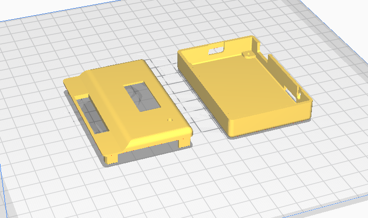
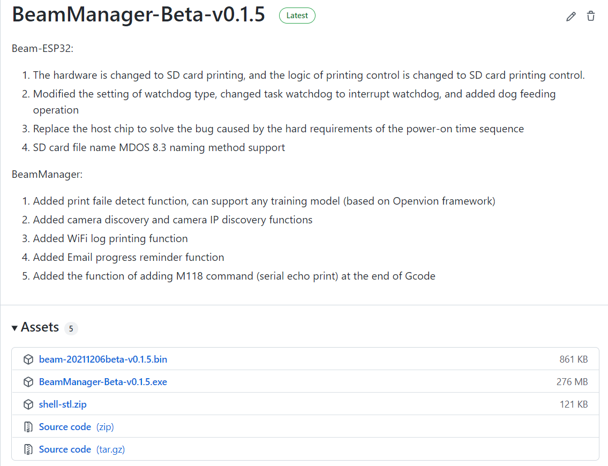
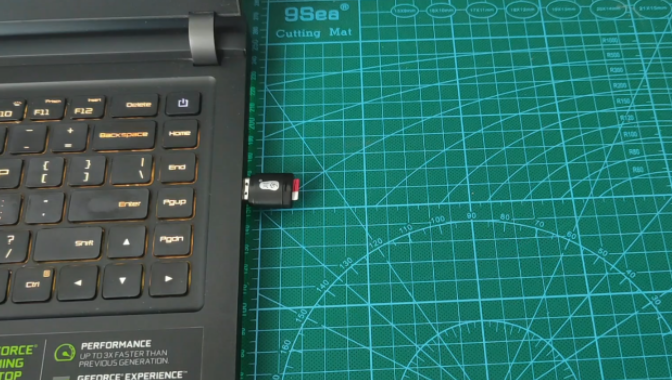
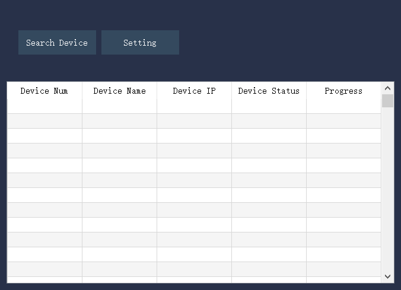
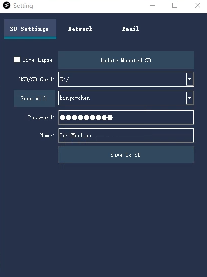

# 1. Beam Node快速开始

## 1. 使用前须知

强烈建议在购买我们的模块之后，下载我们的外壳，使用您的打印机打印出一个外壳来。 注意打印时加入支撑。 模型外壳如下图所示:
[外壳下载链接](https://github.com/fiberpunk1/Beam-ESP32/releases/download/Beta-v0.1.5/shell-stl.zip)

## 2. 快速上手

### 2.1 下载和安装软件

请从这个[链接](https://github.com/fiberpunk1/Beam-ESP32/releases)下载我们BeamNexus软件的安装包:

> 注意: BeamNexus目前只支持windows版本

### 2.2 配置SD卡

首先将您的SD卡和读卡器，插入到电脑:

插入SD卡后，打开BeamManager，点击下图中所示的Setting按钮:

单击后弹出下图所示的窗口，我们要在这里填写Wifi名和密码，以及为您的Beam模块去一个设备名(局域网不要重复使用同一个设备名)。具体的填写内容，如下图所示:

