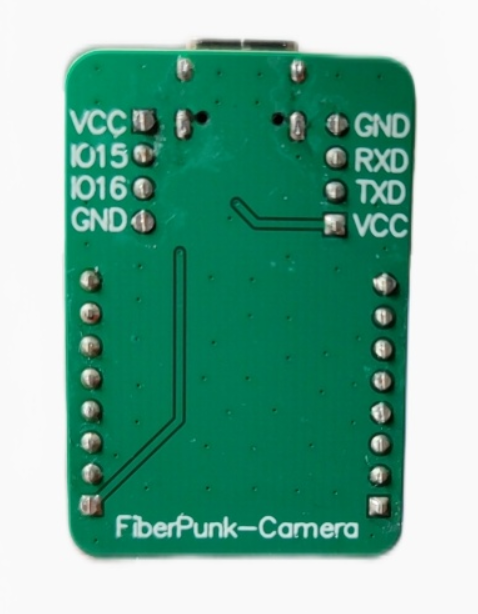
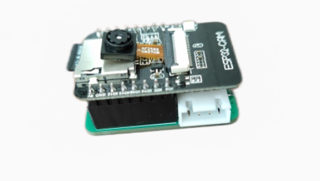
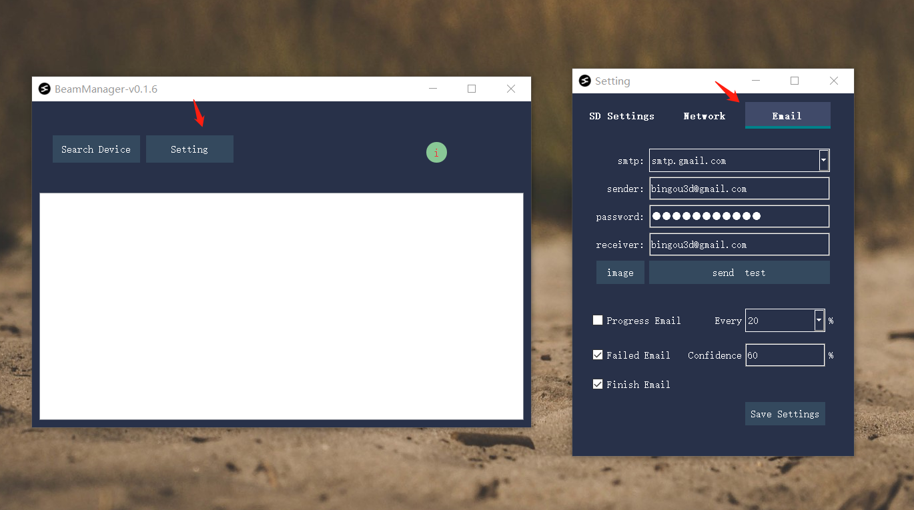
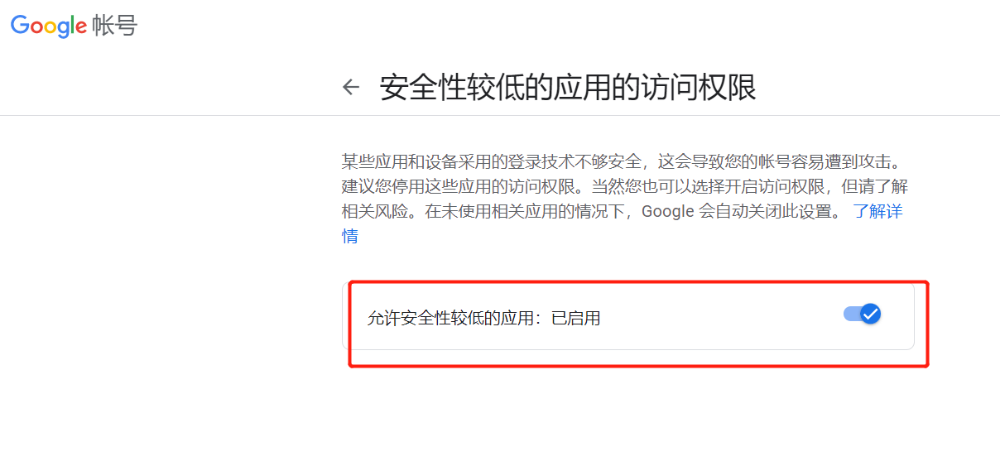
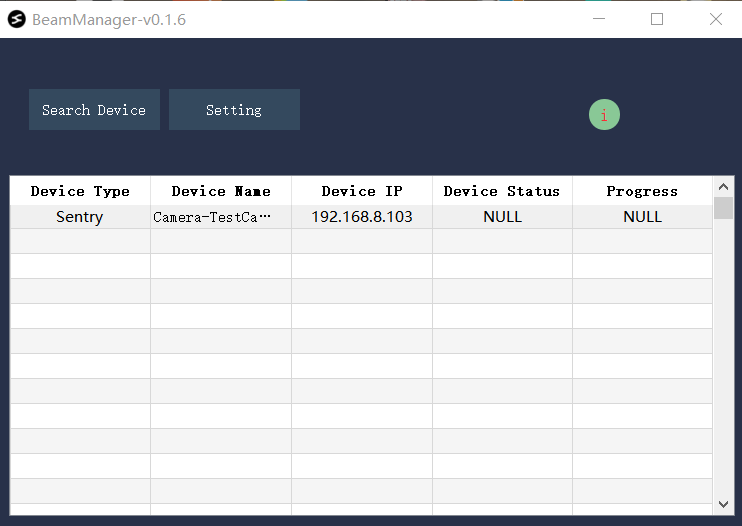

# 1.下载和安装

本文档用于对我们中间迭代产品的一个简要使用说明，这不是Beamsentry的全部功能以及最终产品形态，主要用于测试和验证基本的功能。按照本文档，做一个基本流程测试(本说明文档会持续更新)。

## 1.1 简介

Beamsentry产品如下图:

侧面的插口，一个是串口，用来接3D电机，一个是IO控制口，可以扩展断料检测。有RX和TX丝印的一侧表示串口端口。

# 2.使用简介

## 2.1 配网
Beamsentry的配网跟BeamNode一样，需要使用SD卡配网。 可以参考个[文档](../start.md)中的配网部分说明。

## 2.2 邮件设置

首先要选择谷歌邮箱，目前也只支持谷歌邮箱。

然后要在浏览器上登录你的谷歌浏览器，通过这个网址，https://myaccount.google.com/lesssecureapps
授权外部软件可以登录您的谷歌邮箱。 我们建议您申请一个专门的提示邮箱，来执行这个任务。

设置好以后，最后点击send test, 发送测试邮件，检测您是否能正常收到邮件。如果可以,那说明设置成功

## 2.3 使用介绍

首先打开软件，点击Search Devices(请确保配网完成了))。搜索一会以后，搜到设备后显示如下:

双击你要打开的sentry，会弹出如下界面:

点击capture test，会拍摄一张图片，并显示在窗口右侧。 在Gcode输入栏里面，输入您想要让串口发送的指令，sentry就会通过串口给打印机下发对应的指令。 Toggle Detector就会触发检测，开启打印失败检测。(后面会加入相关配置选项，以及烟雾火苗检测，还有基本的gcode发送按钮)